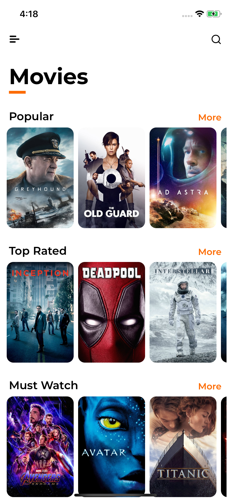
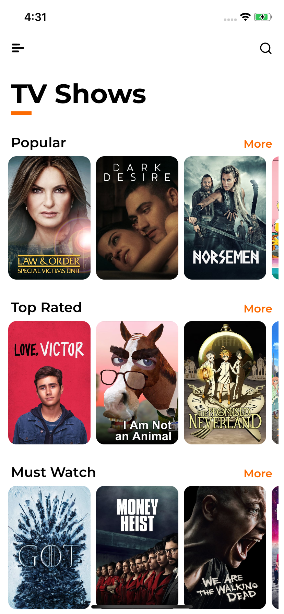
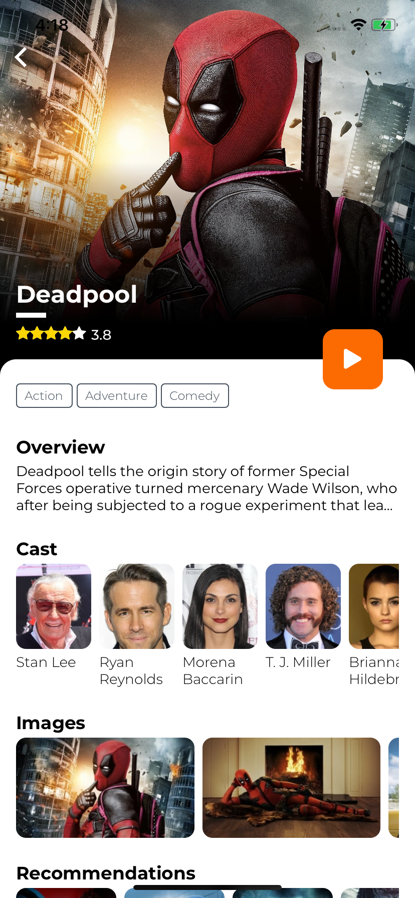
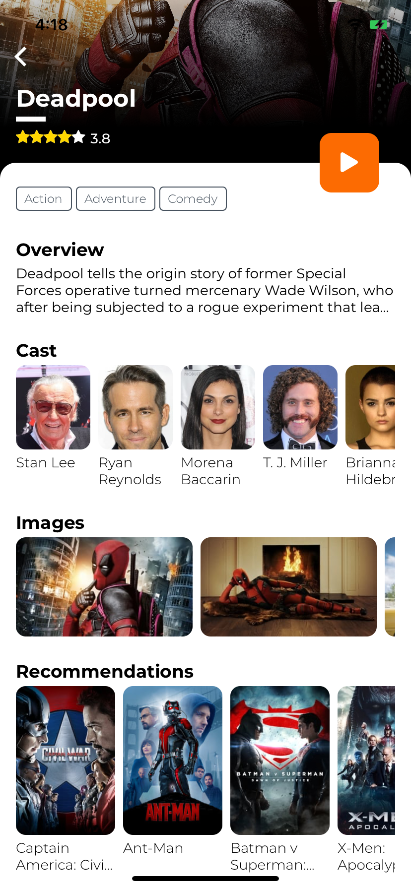
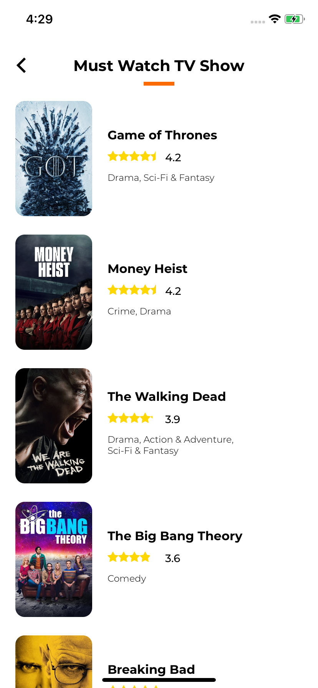
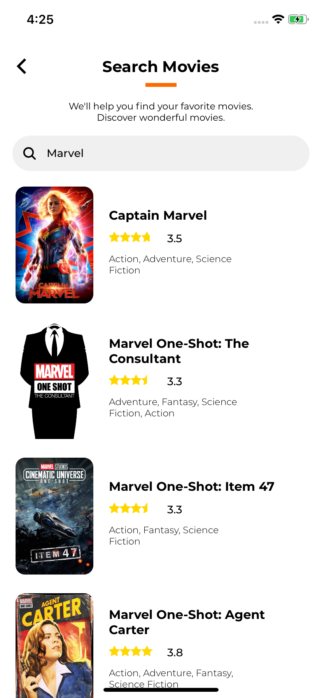
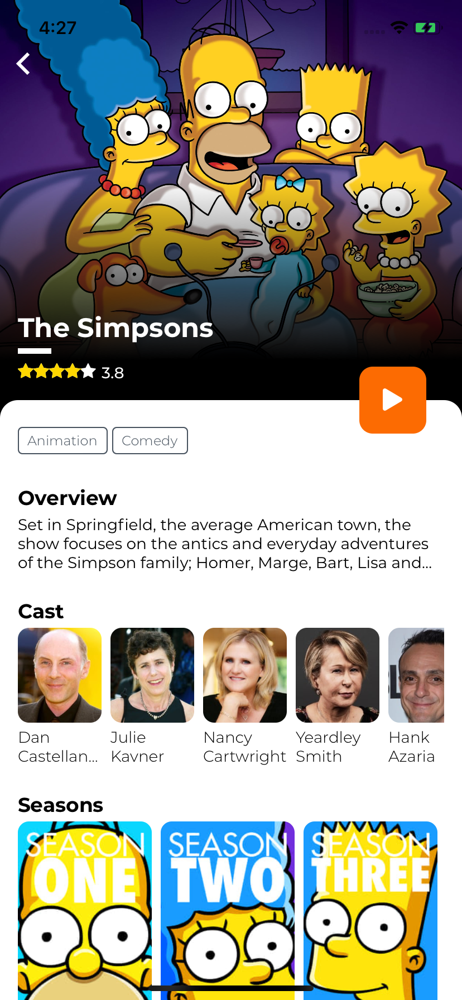
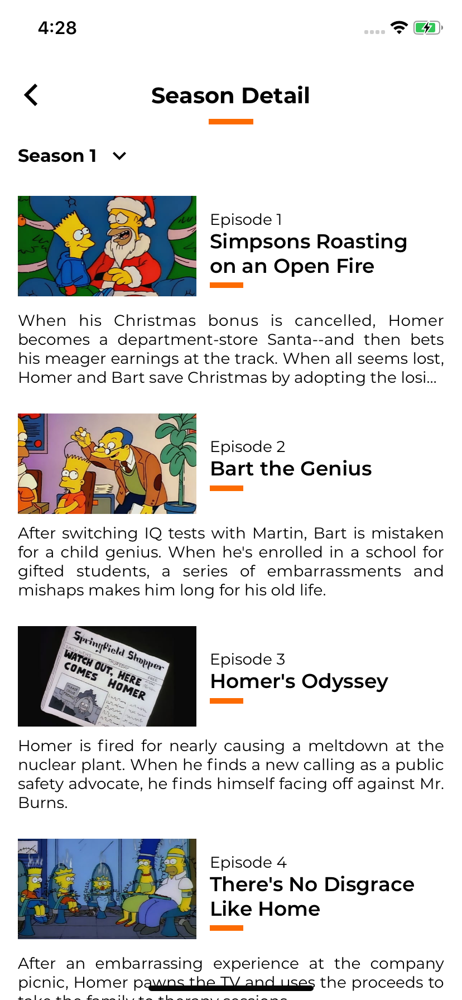

<h1 align="center">
  <br>
  <a href="github.com/ahnafalfariza/moviesdaily" style="color: black"><span>MoviesDaily</span></a><br>
</h1>

<p align="center">
  
  
  
</p>

## Overview

Movies and TV Show mobile application. Available for iOS and Android.
Developed as a personal project, created using [React Native](https://facebook.github.io/react-native/) and [TMDb](https://www.themoviedb.org/) API.

## Screenshot










## Features

- Search movie and tv show
- Discover tv and movies
- Watch videos related
- See images related to movie
- Provide every season episode info
- and many more

## Installation

Make sure you have setup react native environment [here](https://reactnative.dev/docs/environment-setup)

Clone this repo

```
$ git clone https://github.com/ahnafalfariza/MoviesDaily.git
$ cd MoviesDaily
```

Install dependencies

```sh
$ npm install
```

If you're running iOS, make sure you install the pods

```sh
$ cd ios
$ pod install
```

Run android or ios

```
$ npm run android
```

```
$ npm run ios
```

## License

Project is published under the [MIT license](/LICENSE.md).
